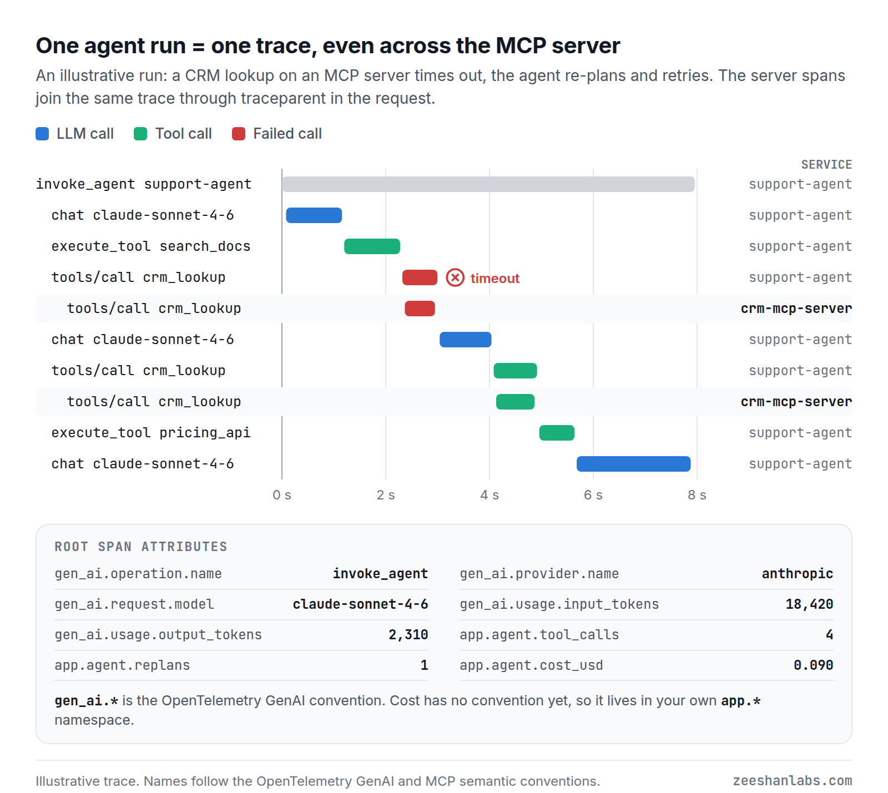

# Agent observability with OpenTelemetry

Runnable companion to the article **[How to Monitor AI Agents in Production with OpenTelemetry](https://zeeshanlabs.com/blog/ai-agents-observability-production)**.

A simulated support agent that emits real OpenTelemetry traces and metrics:

- **Standard span names.** `invoke_agent`, `chat {model}` and `execute_tool {tool}` spans with `gen_ai.*` attributes, following the [OpenTelemetry GenAI semantic conventions](https://github.com/open-telemetry/semantic-conventions-genai).
- **MCP calls in the same trace.** `tools/call` requests carry W3C trace context in `params._meta`, as documented in the MCP 2026-07-28 specification, so the tool server's spans join the agent's trace.
- **Cost per run.** Token usage, tool calls, replans and estimated cost on the root span, and as metrics.
- **Three alerts that should page someone.** Cost spike, tool failure rate and reasoning loop, each with a `promtool` unit test.

No LLM or API key needed: model calls and tools are faked so the shape of the telemetry is the focus.



## Run it

### 1. The code on its own

```bash
python -m venv .venv && . .venv/bin/activate
pip install -r requirements.txt
python demo.py
```

With no collector configured, the trace is printed as a tree:

```text
invoke_agent support-agent                      2152 ms  [support-agent]
  chat claude-sonnet-4-6                         350 ms  [support-agent]
  execute_tool search_docs                       300 ms  [support-agent]
  tools/call crm_lookup                          250 ms  [support-agent]  x timeout
    tools/call crm_lookup                        250 ms  [crm-mcp-server]  x timeout
  chat claude-sonnet-4-6                         300 ms  [support-agent]
  tools/call crm_lookup                          250 ms  [support-agent]
    tools/call crm_lookup                        250 ms  [crm-mcp-server]
  execute_tool pricing_api                       200 ms  [support-agent]
  chat claude-sonnet-4-6                         500 ms  [support-agent]
    gen_ai.usage.input_tokens = 18420
    gen_ai.usage.output_tokens = 2310
    app.agent.tool_calls = 4
    app.agent.replans = 1
    app.agent.cost_usd = 0.08991
```

Other scenarios: `python demo.py --scenario normal` or `--scenario loop`.

### 2. Full stack: Collector, Jaeger and Prometheus

```bash
docker compose up -d
OTEL_EXPORTER_OTLP_ENDPOINT=http://localhost:4317 python demo.py --runs 100 --mix
```

- **Jaeger** at http://localhost:16686. Search for service `support-agent`. Runs that call the CRM tool also show `crm-mcp-server`, in the same trace.
- **Prometheus** at http://localhost:9090/alerts. `AgentReasoningLoop` fires shortly after the first loop run.

`docker compose down` when you're done.

### 3. Tests

```bash
python -m unittest discover -s tests -t .
docker run --rm -v "$PWD/observability:/rules" -w /rules --entrypoint promtool \
  prom/prometheus:v3.14.0 test rules alerts.test.yml
```

CI runs both on every push.

## What's where

| File | What it shows |
|---|---|
| [`agent_otel/tracing.py`](agent_otel/tracing.py) | Agent, model and tool spans plus the metrics the alerts use |
| [`agent_otel/mcp.py`](agent_otel/mcp.py) | Trace context in `params._meta`, MCP client and server spans |
| [`agent_otel/setup.py`](agent_otel/setup.py) | Tracer and meter providers: OTLP, or in-memory for the console tree |
| [`demo.py`](demo.py) | The simulated agent: normal, tool-failure and loop scenarios |
| [`observability/alerts.yml`](observability/alerts.yml) | The three alert rules |
| [`observability/alerts.test.yml`](observability/alerts.test.yml) | `promtool` unit tests for them |
| [`observability/otel-collector.yaml`](observability/otel-collector.yaml) | OTLP in, traces to Jaeger, metrics to Prometheus |

## Names used

| Where | Name | Source |
|---|---|---|
| Agent run span | `invoke_agent {agent}` | GenAI conventions |
| Model call span | `chat {model}` | GenAI conventions |
| Local tool span | `execute_tool {tool}` | GenAI conventions |
| MCP tool span (client and server) | `tools/call {tool}` | MCP conventions |
| Provider, model, tokens | `gen_ai.provider.name`, `gen_ai.request.model`, `gen_ai.usage.input_tokens`, `gen_ai.usage.output_tokens` | GenAI conventions |
| Tool and failure | `gen_ai.tool.name`, `gen_ai.tool.call.id`, `error.type` | GenAI conventions |
| Cost, tool calls, replans | `app.agent.cost_usd`, `app.agent.tool_calls`, `app.agent.replans` | No convention yet, so they live under `app.*` |

The GenAI and MCP conventions are still in *Development* status, so names can change. These follow the spec as of September 2026.

## Notes

- Prices in `tracing.py` are an example table. Keep real prices in config.
- In production the MCP server is its own process. Here a second tracer provider with its own `service.name` stands in for it.
- The loop alert reads the histogram's `le="12"` bucket, so `setup.py` sets 12 as a bucket edge. Change both together.

## Author

**Zeeshan Fahad**, AI & Cloud Engineer · [zeeshanlabs.com](https://zeeshanlabs.com) · [LinkedIn](https://www.linkedin.com/in/zeeshanfahad)

MIT licensed.
